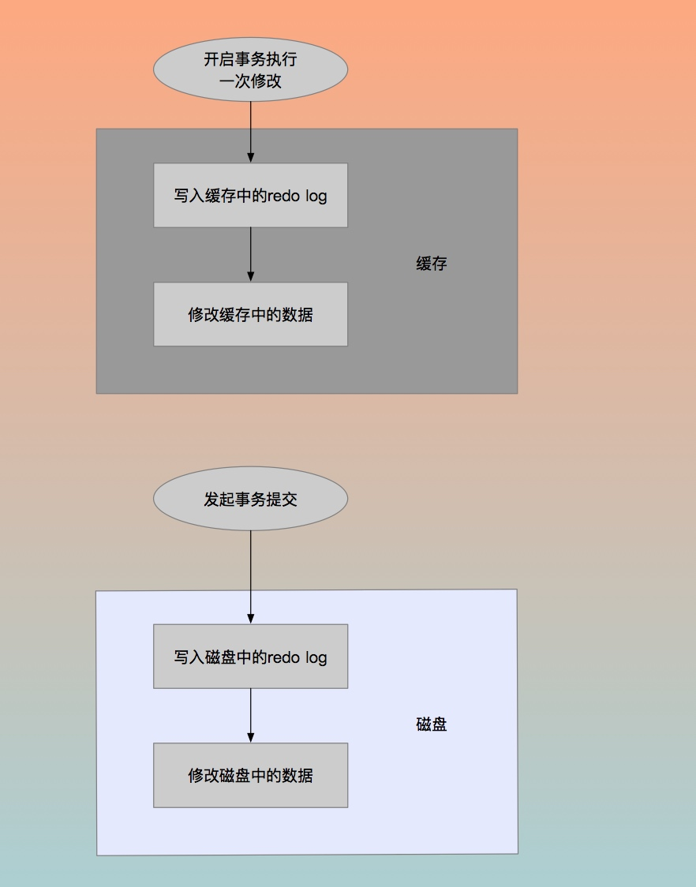
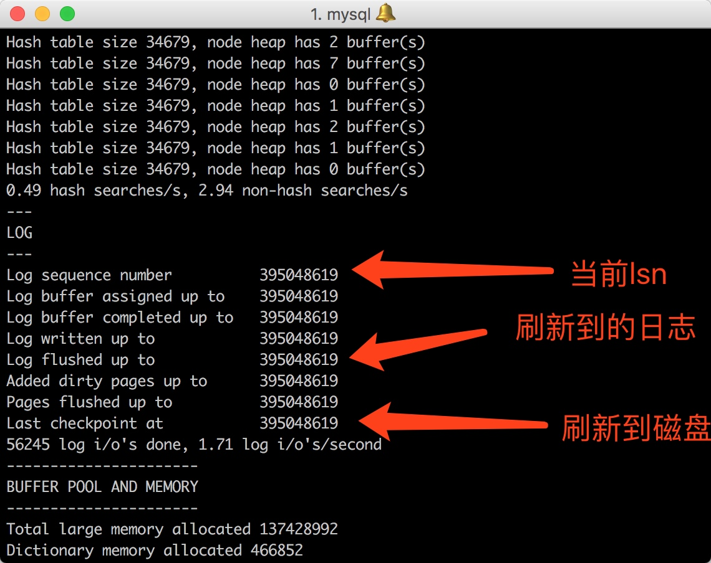
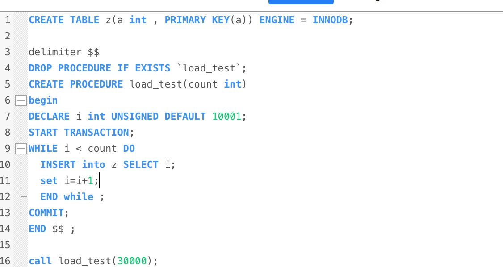
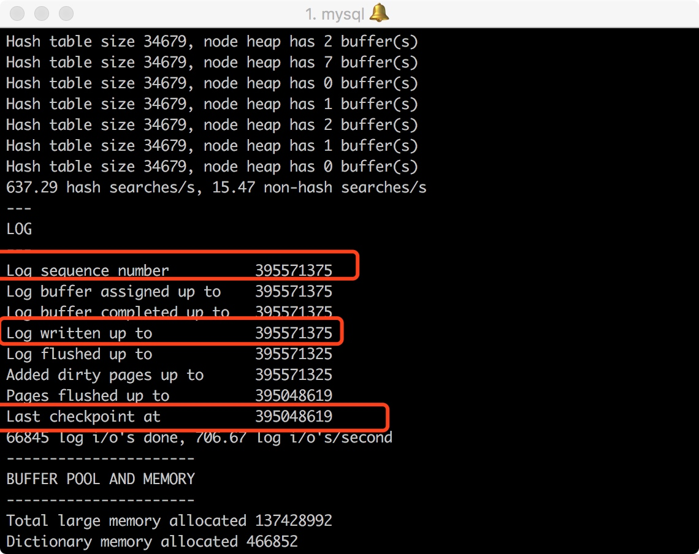

# mysql事务浅析二 (实现原理)
事务的概念以及特性我们在上一章里已经描述过了,那么事务是怎么实现的呢?
事务的四大特性里, 隔离性,是由锁实现的(前边也有讲过锁).  那么其他三个,原子性、一致性、持久性，则是由redo日志，以及undo日志完成的。
## redo日志
redo日志，重做日志。是一种物理日志，记录的是物理页的修改，可以用来恢复已经提交过的数据，单只能恢复到最后一次提交的数据点的lsn。（LSN称为日志的逻辑序列号 log sequence number ）

redo log包括两部分：一是内存中的日志缓冲(redo log buffer)，该部分日志是易失性的；二是磁盘上的重做日志文件(redo log file)，该部分日志是持久的。

当事务执行时，会先往缓存中的的redo日志插入事务日志，再修改缓存中的数据，在提交事务时，也将redolog写入磁盘，然后才会将磁盘上的数据修改。这种操作叫做，日志预写。如下图

redo 日志有三比较重要的参数

执行 `show engine innodb status\G;`

我们尝试执行一段事务

再观察

我们可以看到的是，395571375 - 395048619 = 552756 约为500k，可以看做是重组日志的增量。

##undo 日志
redo日志是用来记录做过的事情，而undo日志，是反向的。

undo log和redo log记录物理日志不一样，它是逻辑日志。可以认为当delete一条记录时，undo log中会记录一条对应的insert记录，反之亦然，当update一条记录时，它记录一条对应相反的update记录。

当执行rollback时，就可以从undo log中的逻辑记录读取到相应的内容并进行回滚。

除了回滚以外，undo日志，还有mvcc的作用。什么是mvcc呢？
###MVCC 
MVCC (Multiversion Concurrency Control)，即多版本并发控制技术,它使得大部分支持行锁的事务引擎，不再单纯的使用行锁来进行数据库的并发控制，取而代之的是把数据库的行锁与行的多个版本结合起来，只需要很小的开销,就可以实现非锁定读，从而大大提高数据库系统的并发性能。 具体的mvcc将在下章讨论。

参考和引用
mysql技术内幕innodb存储引擎
https://www.cnblogs.com/chenpingzhao/p/5065316.html
https://www.cnblogs.com/f-ck-need-u/archive/2018/05/08/9010872.html#auto_id_11

